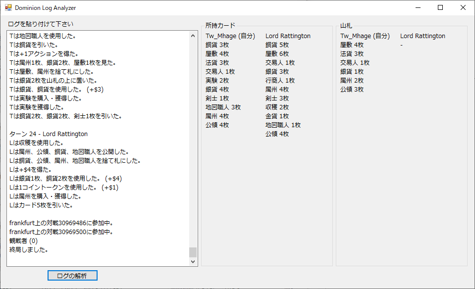

# Dominion Log Anlyzer
ドミニオンオンラインのログの解析ツールです。対応は日本語のみです。二人戦のみです。
 

## 開発環境
Visual Studio 2017

## 実行ファイル
Dominion_Log_Analyzer.exe

## 使い方
1. ログをコピ&ペーストします。
2. ログの解析ボタンを押します。
3. 自分と相手の所持カードと、自分の山札が表示されます。

## 所持カードについて
所持しているすべてのカードが表示されます。全拡張対応です。

## 山札について
各カードの効果による山札の変化は基本カード、陰謀、海辺、錬金術(支配を除く)、繁栄、収穫祭、異郷、暗黒時代、ギルド、プロモ、冒険に対応しています。
残りの拡張カードは順次対応していきます。

## ログの問題
- 伝令官の購入時効果：この効果で山札に行くカード名が匿名の「カード」となるログの不具合があるため正常動作しません。
- 隠遁者使用時の廃棄：手札から廃棄したか捨て札から廃棄したかはログから判別できません。手札からを優先とします。
- 家臣使用時の効果：家臣で山札から捨て札にしたカードを使用せずに、次のアクションで手札から同名のカードを使用した場合はログから判別できません。そういう動きをすると正常動作しません。