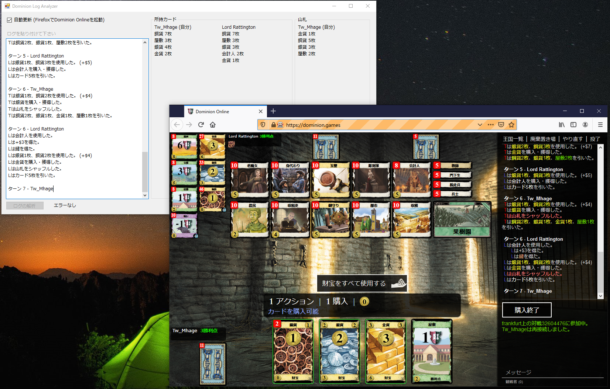

# Dominion Log Anlyzer
ドミニオンオンラインのログの解析ツールです。対応は日本語のみです。
 

## 使い方
1. ログをコピ&ペーストします。
2. ログの解析ボタンを押します。
3. 所持カードが表示されます。

## 山札について
自分の山札のみです。
前回のシャフル時の所持カードからシャフル時以降引いたカードを除いただけの実装なので実際と異なります。
順次改良していきます。